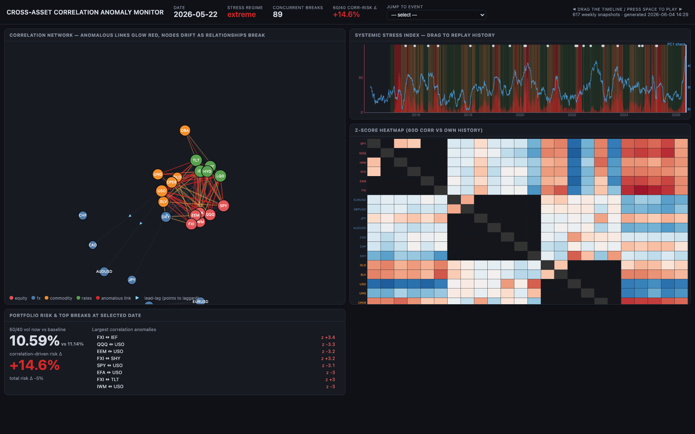

# Cross-Asset Correlation Anomaly Detector

A research pipeline that tracks **rolling correlations across a multi-asset universe** (equities, FX, commodities, rates/credit), flags statistically significant **correlation regime breaks**, corrects for multiple comparisons, and translates the current correlation regime into a **portfolio risk lens** — all rendered into a self-contained interactive HTML dashboard.

The core idea: individual asset prices are noisy, but the *relationships between* assets carry regime information. When correlations that "should" hold (stocks vs. bonds, gold vs. the dollar, oil vs. the Canadian dollar) break down or invert, that's often an early signal of a stress regime, a factor rotation, or a diversification breakdown that reprices portfolio risk.

> ⚠️ **Not investment advice.** This is a quantitative research tool for studying cross-asset relationships. It makes no return predictions and should not be used as the basis for trading decisions.

---

## 🔴 Live example

**▶ [View the interactive dashboard](https://ommaganti.github.io/cross-asset-anomaly/)** — hosted on GitHub Pages.

[](https://ommaganti.github.io/cross-asset-anomaly/)

A static, self-contained snapshot generated by the pipeline (universe history **2014-01-03 → 2026-05-28**, 617 weekly snapshots). Everything is embedded inline — no backend. On the live page you can:

- **Drag the timeline** (or press <kbd>Space</kbd> to autoplay) to replay 617 weekly snapshots of the correlation regime.
- Watch the **correlation network** re-lay-out as relationships form and break — anomalous links glow red, nodes drift apart as they de-correlate.
- Scrub the **systemic stress index** (concurrent pair breaks) with its calm/elevated/extreme regime shading and PC1-share overlay.
- Read the **z-score heatmap** (each pair's 60-day correlation vs. its own history) and the **portfolio risk lens** — including the correlation-driven risk Δ discussed [below](#interpreting-the-dashboard-the-portfolio-risk-lens).
- Jump straight to any macro event from the dropdown.

> The snapshot is committed at [`docs/`](docs/) and served verbatim by Pages. Regenerate a fresh one anytime with `python -m cross_asset_anomaly` (writes `output/dashboard.html`).

---

## What it does

1. **Pulls daily prices** for a ~24-asset cross-asset universe via `yfinance` (cached locally as Parquet).
2. **Computes rolling correlations** on volatility-adjusted returns across multiple windows (20/60/252-day) and multiple estimators:
   - Pearson and Spearman (rank) correlation
   - **Tail dependence** — correlation conditional on both assets being in their joint lower/upper tail
   - **Partial correlation** — correlation after residualizing out common factors (USD, SPY, TLT, USO)
   - **Lead–lag** — the lag that maximizes cross-correlation, to catch one asset leading another
3. **Detects anomalies** by z-scoring each correlation series against its own history, requiring the break to *persist* for N consecutive bars, and tagging the prevailing regime (vol / curve / USD / credit).
4. **Corrects for multiple comparisons** with a per-date Benjamini–Hochberg (FDR) filter — because testing hundreds of pairs daily guarantees false positives.
5. **Measures systemic stress** — how many pairs are breaking at once — as a top-level dial with its own regime classification.
6. **Decomposes factor structure** via rolling PCA (share of variance in PC1, eigenvalue dispersion).
7. **Runs a portfolio risk lens** on canonical portfolios (60/40, global 60/40, risk parity, all-weather), separating how much the change in portfolio risk is driven by *correlations* vs. *volatilities* (see below).
8. **Backtests** conditional forward returns following anomaly dates.
9. **Renders** CSVs, static heatmaps/PNGs, and an interactive `dashboard.html`.

---

## Asset universe

| Class | Tickers |
|---|---|
| **Equity** | SPY, QQQ, IWM, EFA, EEM, FXI |
| **FX** | EUR/USD, GBP/USD, USD/JPY, AUD/USD, USD/CAD, USD/CHF, DXY |
| **Commodity** | GLD, SLV, USO, UNG, CPER, DBA |
| **Rates / Credit** | TLT, IEF, SHY, LQD, HYG |

`^VIX` is used for regime classification (not as a tradable). A set of **structural pairs** with strong economic priors (e.g. gold↔USD negative, HY credit↔equity positive, USD/CAD↔oil negative) is defined in [`pairs.py`](pairs.py); breaks in these carry more signal than breaks in arbitrary pairs, and a sign flip is flagged as a **structural sign violation**.

---

## Installation

Requires Python 3.10+.

```bash
git clone https://github.com/ommaganti/cross-asset-anomaly.git
cd cross-asset-anomaly
python -m venv .venv && source .venv/bin/activate
pip install -r requirements.txt
```

Dependencies: `numpy`, `pandas`, `scipy`, `yfinance`, `matplotlib`, `pyarrow`.

Optionally install it as a package instead, which also puts a `cross-asset-anomaly` command on your PATH:

```bash
pip install -e .
```

---

## Usage

From the repository root:

```bash
python -m cross_asset_anomaly --start 2014-01-01 --output-dir ./output
```

Or, if you installed with `pip install -e .`, from anywhere:

```bash
cross-asset-anomaly --start 2014-01-01 --output-dir ./output
```

On first run it downloads and caches prices; subsequent runs reuse the cache. Outputs land in `--output-dir` (default `./output`).

### Key CLI options

| Flag | Default | Meaning |
|---|---|---|
| `--start` / `--end` | `2014-01-01` / latest | Price history range |
| `--windows` | `20,60,252` | Rolling-correlation windows (days) |
| `--primary-window` | `60` | Window used for the headline correlation matrix and heavier metrics |
| `--zscore-lookback` | `756` | Bars of history used to z-score each correlation series |
| `--z-threshold` | `2.5` | Z-score magnitude required to flag an anomaly |
| `--persistence` | `3` | Consecutive bars an alert must hold to be flagged |
| `--tail-q` | `0.10` | Tail quantile for tail-dependence |
| `--fdr-alpha` | `0.05` | Benjamini–Hochberg false-discovery-rate level |
| `--risk-current-window` | `60` | Current correlation-regime window for the risk lens |
| `--risk-baseline-window` | `1260` | Trailing baseline window (~5y) for the risk lens |

---

## Outputs

Written to the output directory:

- **`dashboard.html`** — self-contained interactive dashboard (data embedded inline; open in any browser).
- `alerts.csv` / `alerts_top.csv` — all persistent anomalies / biggest-ever per pair+metric.
- `fdr_alerts.csv` — anomalies surviving FDR correction.
- `structural_sign_violations.csv` — structural pairs whose correlation sign has flipped.
- `systemic_stress.csv` — daily systemic-stress time series.
- `portfolio_risk.csv` / `portfolio_pair_attribution.csv` — the risk lens and its pair-level attribution.
- `backtest_conditional_forward_returns.csv` / `anomaly_followups.csv` — forward-return study.
- `heatmap_delta_vs_norm.png`, `heatmap_zscore.png`, `pca_factor_structure.png`, `systemic_stress.png`.

---

## Interpreting the dashboard: the portfolio risk lens

The risk-lens panel answers a portfolio manager's question: *how is today's correlation regime repricing my portfolio's risk, and is it correlations or volatilities driving it?*

It computes annualized portfolio volatility three ways over a canonical 60/40 book, using the covariance $\Sigma = \text{diag}(\sigma)\, R\, \text{diag}(\sigma)$:

- **`vol_baseline_ann`** — vol using **baseline** correlations *and* **baseline** vols (trailing ~5y).
- **`vol_current_ann`** — vol using **current** correlations *and* **current** vols (last 60d).
- **`delta_total_pct`** = % change from baseline to current (both moved).
- **`delta_corr_only_pct`** — the counterfactual: hold each asset's vol at baseline, move **only the correlation matrix** to today's regime. This isolates the **diversification-breakdown** contribution.
- **`delta_vol_only_pct`** — the mirror counterfactual: move only vols, hold correlations fixed.

So a prominent figure like **`delta_corr_only_pct = +16%`** reads as: *"if only correlations shifted to today's regime and every asset's own volatility stayed at its 5-year baseline, 60/40 portfolio volatility would be 16% higher."* It is a **volatility** quantity — not VaR, not drawdown. (The module also exposes a parametric 95% VaR as `1.645 × vol`; since that's proportional to vol, a 16% rise in vol is numerically also a 16% rise in parametric VaR, but the decomposition itself is defined on vol.)

The **pair attribution** table decomposes that correlation-driven risk change into individual pairs via
$\Delta\text{Var} \approx \sum_{i<j} 2\, w_i w_j\, \sigma_i \sigma_j\, \Delta\rho_{ij}$,
so you can see *which* correlation moves (e.g. SPY–TLT de-correlating) are doing the work.

Other panels: the **systemic stress** dial (concurrent pair breaks + regime), the **correlation z-score heatmap** (which pairs are most anomalous vs. their own history), the **PC1 share** timeline (how much the whole universe is moving as one factor), and an event calendar overlay.

---

## Methodology notes

- **Vol-adjusted returns.** Correlations are computed on returns standardized by trailing realized vol, so they reflect co-movement of *direction* rather than being dominated by vol regimes.
- **No lookahead.** Regime terciles, z-score baselines, and the risk-lens baseline all use trailing windows only.
- **Persistence + FDR.** Requiring an anomaly to persist and then applying Benjamini–Hochberg per date is a deliberate two-stage guard against the multiple-comparisons problem inherent in scanning hundreds of pairs every day.
- **Structural priors.** Economic priors (`pairs.py`) let the tool distinguish "a pair that broke and *should* worry you" from "a pair that broke but has no strong prior."

---

## Project structure

```
cross-asset-anomaly/
├── cross_asset_anomaly/       # the Python package
│   ├── __main__.py            # CLI entry point (python -m cross_asset_anomaly)
│   ├── pipeline.py            # 9-stage orchestrator + summary
│   ├── data.py                # price download, caching, returns, vol-adjustment
│   ├── universe.py            # asset universe + factor/regime tickers
│   ├── pairs.py               # structural pairs with economic priors
│   ├── correlations.py        # pearson / spearman / tail-dep / partial / lead-lag
│   ├── pca_factors.py         # rolling PC1 share + eigenvalue dispersion
│   ├── regimes.py             # vol / curve / USD / credit regime axes
│   ├── detector.py            # z-score + persistence anomaly detection
│   ├── fdr.py                 # Benjamini–Hochberg multiple-comparison correction
│   ├── systemic.py            # systemic stress index
│   ├── portfolio.py           # canonical portfolios + risk lens + pair attribution
│   ├── backtest.py            # conditional forward-return study
│   ├── events.py              # macro event calendar / alert tagging
│   ├── dashboard.py           # interactive self-contained HTML dashboard
│   └── viz.py                 # static matplotlib heatmaps / time series
├── docs/                      # committed dashboard snapshot served by GitHub Pages
├── pyproject.toml
├── requirements.txt
└── README.md
```

---

## License

[MIT](LICENSE) © 2026 ommaganti
